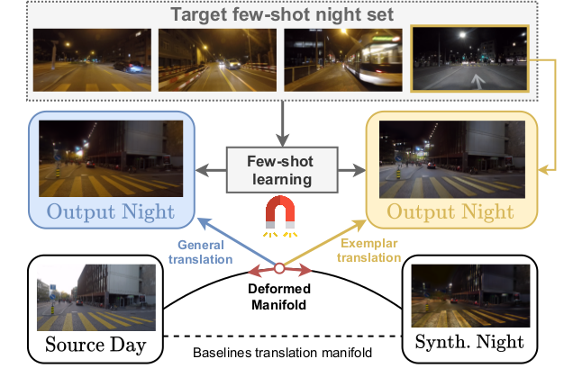

# ManiFest: Manifold Deformation for Few-shot Image Translation

[ManiFest: Manifold Deformation for Few-shot Image Translation](https://arxiv.org/abs/2111.13681)  
Fabio Pizzati, Jean-François Lalonde, Raoul de Charette  

ArXiv 2021

## Preview



## Citation
To cite our paper, please use
```
@article{pizzati2021manifest,
  title={{ManiFest: Manifold Deformation for Few-shot Image Translation}},
  author={Pizzati, Fabio and Lalonde, Jean-François and de Charette, Raoul},
  journal={arXiv preprint},
  year={2021}
}
```

## Prerequisites
Please create an environment using the `requirements.yml` file provided.

```conda env create -f requirements.yml```

Download the pretrained models and the pretrained VGG used for the style alignment loss by following the link:

```
https://www.rocq.inria.fr/rits_files/computer-vision/manifest/manifest_checkpoints.tar.gz
```

Move the VGG network weights in the `res` folder and the checkpoints in the `checkpoints` one.

## Inference 
We provide pretrained models for the day2night, day2twilight and clear2fog tasks as described in the paper.

To perform `general` inference using the pretrained model, please run the following command:

```
python inference_general.py --input_dir <input_directory> --output_dir <output_directory> --checkpoint <checkpoint_path>
```

To perform `exemplar` inference, please use

```
python inference_exemplar.py --input_dir <input_directory> --output_dir <output_directory> --checkpoint <checkpoint_path> --exemplar_image <path_to_exemplar_image>
```

## Training

We provide training code for all three tasks. 

Download the [ACDC](https://acdc.vision.ee.ethz.ch/), 
[VIPER](https://playing-for-benchmarks.org/) and 
[Dark Zurich](https://www.trace.ethz.ch/publications/2019/GCMA_UIoU/) datasets.

Then, run the scripts provided in the `datasets' directory to create symbolic links.

```
python create_dataset.py --root_acdc <root acdc> --root_viper <root viper> --root_dz <root_dark_zurich>
```

To start training, modify the `data/anchor_dataset.py` file and choose among `day2night`, `day2twilight`
or `clear2fog` in the `root` option. Finally, start the training with

```
python train.py --comment "review training" --model fsmunit --dataset anchor
```

If you don't have a WANDB api key, please run

```
WANDB_MODE=offline python train.py --comment "review training" --model fsmunit --dataset anchor
```

## Code structure
When extending the code, please consider the following structure. The `train.py` file intializes logging utilities and set up callbacks for model saving and debug. The main training logic 
is in `networks/fsmunit_model.py`. In `networks/backbones/fsmunit.py` it's possible to find the architectural components.
